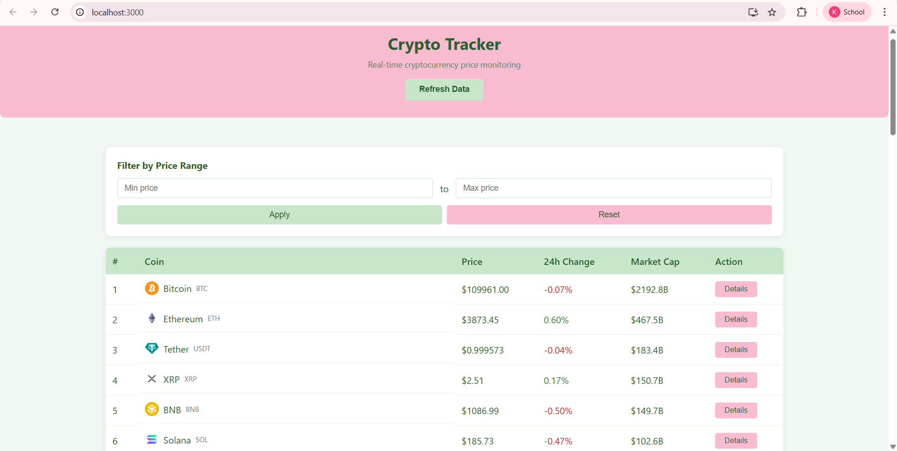
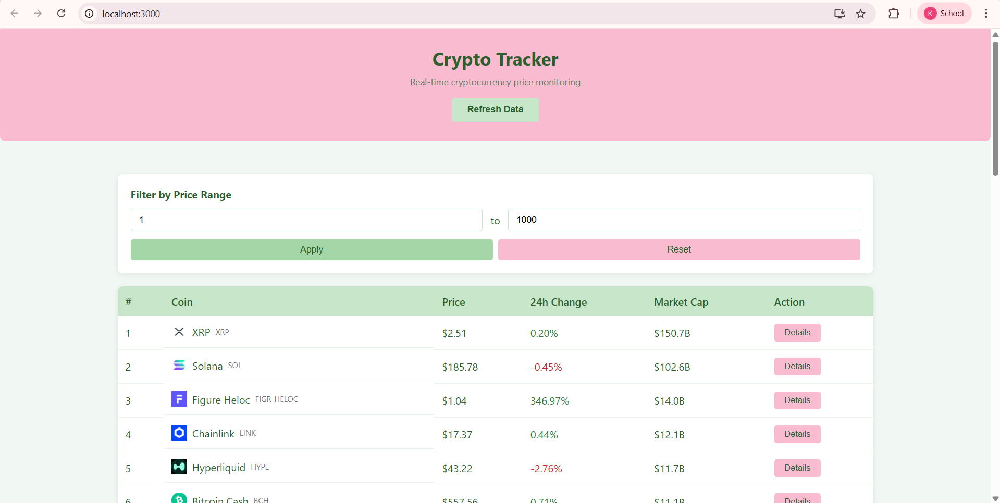
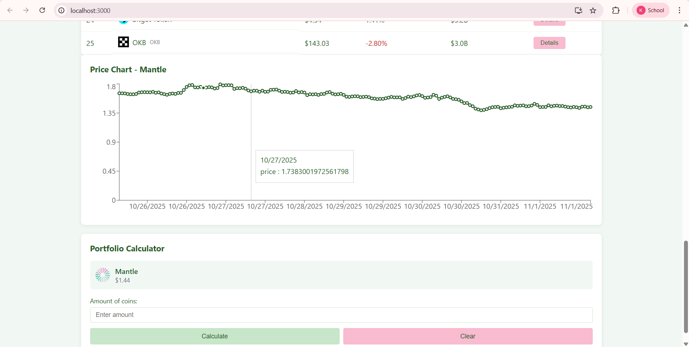
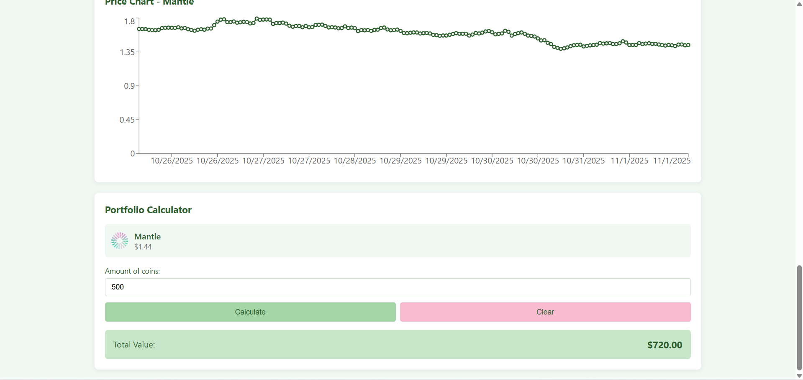

# Cryptocurrency Tracker

UTS Pemrograman Web - Aplikasi tracking harga cryptocurrency real-time

## Identitas

- Nama: Keira Lakeisha Fachra Fuady
- NIM: 123140142
- Mata Kuliah: Pengembangan Aplikasi Web

## Deskripsi Project

Aplikasi web untuk monitoring harga cryptocurrency secara real-time menggunakan CoinGecko API. Pengguna dapat melihat daftar coin, memfilter berdasarkan harga, melihat chart harga, dan menghitung nilai portfolio.

## Fitur

1. Tabel list cryptocurrency dengan price, market cap, dan 24h change
2. Filter cryptocurrency berdasarkan range harga
3. Detail chart harga cryptocurrency (7 hari)
4. Portfolio calculator untuk menghitung total value
5. Refresh data button dengan loading indicator

## Teknologi

- React 18
- Axios untuk HTTP requests
- Recharts untuk visualisasi chart
- CoinGecko API

## Cara Instalasi

1. Clone repository:
```bash
git clone https://github.com/keiralakeisha/uts-pemweb-123140142
cd uts-pemweb-123140142
```

2. Install dependencies:
```bash
npm install
```

3. Buat file `.env` di root folder dan tambahkan API key:
```
REACT_APP_API_KEY=your_api_key_here
```

4. Jalankan aplikasi:
```bash
npm start
```

Aplikasi akan berjalan di http://localhost:3000

## Deployment

Link aplikasi: https://uts-pemweb-123140142.vercel.app/

## Screenshot

### Halaman Utama


Tabel cryptocurrency dengan data real-time

### Filter Harga


Filter cryptocurrency berdasarkan range harga

### Chart Detail


Chart harga cryptocurrency 7 hari terakhir

### Portfolio Calculator


Calculator untuk menghitung nilai portfolio

## Lisensi

Project ini dibuat untuk keperluan UTS Pengembangan Aplikasi Web